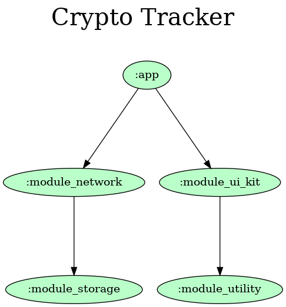

# Crypto-Tracker

This application is for tracking crypto currencies. User can set min/max limits to get notified when
they reach to that limit. You can find crypto currencies change graph as Candle Stick chart in
ranges like(24H, 7d, 14d, 30d, 90d, 180d, 1y, Max).

### Screenshots

  
    

### Project Insights

App is consisted from multiple modules where each has specific purposes. This modular structure
gives us opportunity to divide our forthcoming features into different modules. And by that we can
handle those features without affecting any unrelated part of application.
App has single-activity architecture where our activity handles navigation and some base stuff and
we use fragments for each of our screens.
And lastly for design pattern of project MVVM design pattern is used.
Project is written in [Kotlin](https://kotlinlang.org/) language.
Yuo can have a look below to other libraries which are used in project:

[Coroutines](https://kotlinlang.org/docs/coroutines-overview.html)

[Hilt](https://dagger.dev/hilt/)

[Retrofit](http://square.github.io/retrofit/)

[Room](https://developer.android.com/jetpack/androidx/releases/room?gclid=Cj0KCQiA3-yQBhD3ARIsAHuHT65ZF-lqQ4O_qWATBFoKLr7Nlexjlc0ra-HPdJKYvtrO8nfSmgeFTc4aAlUzEALw_wcB&gclsrc=aw.ds)
is used for Database

[WorkManager](https://developer.android.com/topic/libraries/architecture/workmanager?gclid=Cj0KCQiA3-yQBhD3ARIsAHuHT651zaCQ0PHJA-6JBUqPXqx0oYHvn-QokeaXFg615ut8Es0u2S0UCVEaAlbwEALw_wcB&gclsrc=aw.ds)
is used for background processes

[Glide](https://github.com/bumptech/glide)

[Timber](https://github.com/JakeWharton/timber)

[Mockito](http://site.mockito.org/)

[Navigation component](https://developer.android.com/guide/navigation/navigation-getting-started)

[Shimmer](https://github.com/facebook/shimmer-android) is used for better loading animations

[MPAndroidChart](https://github.com/PhilJay/MPAndroidChart) is used for charts.

[Git Actions](https://github.com/asimanaghayev/Crypto-Tracker/actions) is used for automatic modules
graph generation.

### API

[Coingecko](https://www.coingecko.com/en/api/documentation) is used for API

### App Module Graph

Auto generated by git actions.  

